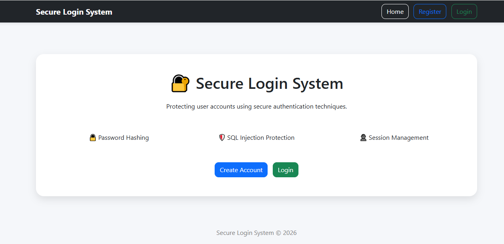
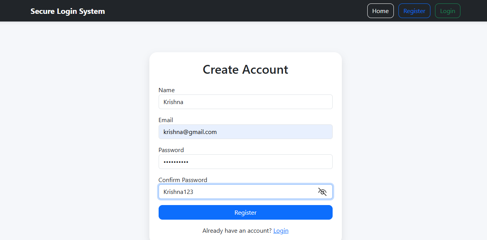
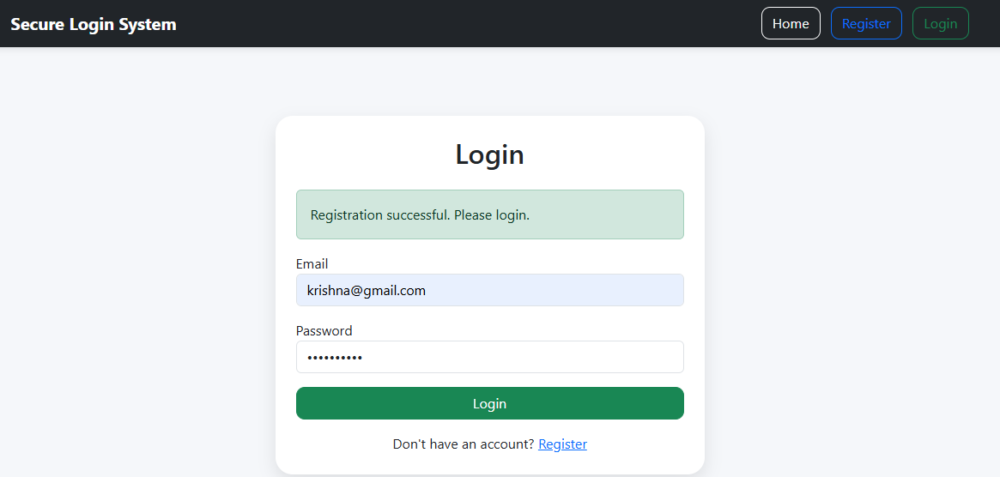
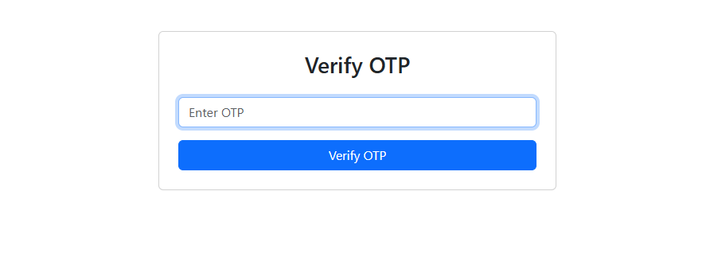
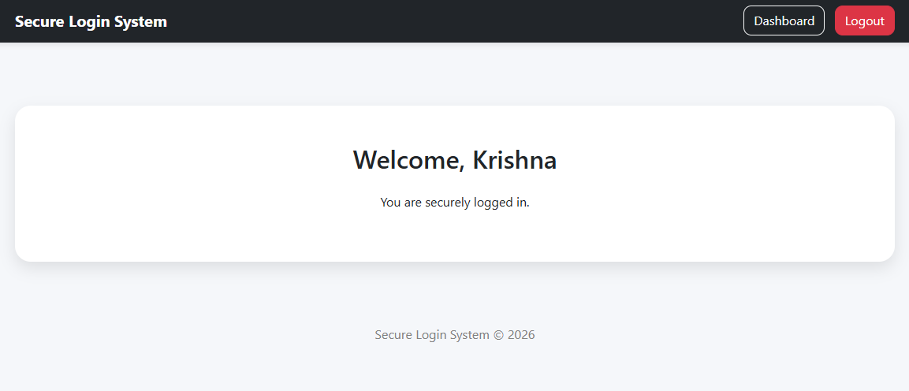

# Secure-login-system

A secure authentication web application built using **Node.js**, **Express.js**, **SQLite**, and **EJS**. The system allows users to register, log in, verify their identity using OTP-based Two-Factor Authentication (2FA), and securely access protected resources.

This project demonstrates essential cybersecurity practices including password hashing, input validation, session management, SQL injection prevention, and multi-factor authentication.

---

## Features

- User Registration
- Secure User Login
- Password Hashing using bcrypt
- Input Validation using express-validator
- SQL Injection Protection through parameterized queries
- Session Management using express-session
- Protected Dashboard Route
- Logout Functionality
- Security Headers using Helmet
- Strong Password Validation
- Duplicate Email Prevention
- OTP-Based Two-Factor Authentication (2FA)

---

## Technologies Used

- Node.js
- Express.js
- SQLite3
- EJS
- bcryptjs
- express-session
- connect-sqlite3
- express-validator
- Helmet
- Bootstrap 5

---

## Project Structure

```text
secure-login-system/
│
├── public/
│   └── css/
│       └── style.css
│
├── views/
│   ├── partials/
│   │   ├── navbar.ejs
│   │   ├── dashboardnavbar.ejs
│   │   └── alerts.ejs
│   │
│   ├── home.ejs
│   ├── register.ejs
│   ├── login.ejs
│   ├── otp.ejs
│   └── dashboard.ejs
│
├── database.js
├── server.js
├── package.json
├── .env
└── .gitignore
```

---

## Installation

### Clone the Repository

```bash
git clone https://github.com/KrishnaPrakashh/secure-login-system.git

cd secure-login-system
```

### Install Dependencies

```bash
npm install
```

### Create Environment Variables

Create a `.env` file in the root directory:

```env
SESSION_SECRET=your_secret_key_here
PORT=5000
```

### Run the Application

Development Mode:

```bash
npm run dev
```

Production Mode:

```bash
node server.js
```

---

## Usage

### Register

Create a new account using a valid email and strong password.

### Login

Log in using registered credentials.

### OTP Verification

After successful login, a 6-digit OTP is generated and must be entered to complete authentication.

### Dashboard

Authenticated users can access the protected dashboard.

### Logout

Ends the current session and prevents unauthorized access to protected routes.

---

## Security Features

### Password Hashing

Passwords are hashed using bcrypt before being stored in the database.

### Input Validation

User inputs are validated using express-validator.

### SQL Injection Protection

Parameterized SQLite queries help prevent SQL injection attacks.

### Session-Based Authentication

User sessions are securely managed using express-session.

### Secure Cookies

- HttpOnly Cookies
- SameSite Protection

### Security Headers

Helmet is used to set secure HTTP headers.

### Two-Factor Authentication (2FA)

A basic OTP-based second authentication step is implemented after successful password verification.

---

## Screenshots

### Home Page



### Register Page



### Login Page



### OTP Verification Page




### Dashboard



---

## Future Improvements

- Email-based OTP Delivery
- Password Reset Functionality
- Account Lockout after Multiple Failed Login Attempts
- User Profile Management
- Activity Logging

---

## Learning Outcomes

This project demonstrates practical implementation of:

- Authentication and Authorization
- Password Security
- Session Management
- Two-Factor Authentication
- Input Validation
- SQL Injection Prevention
- Secure Web Development Practices

---

## Author

**Krishna Prakash**

GitHub: https://github.com/KrishnaPrakashh

---

## License

This project is developed for educational and internship evaluation purposes.
